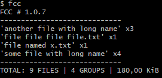
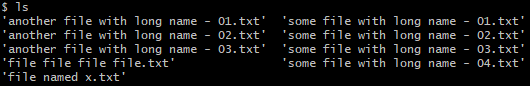

# FCC

[](https://www.codefactor.io/repository/github/mzknek/fcc)

Small console program for parsing directory content.

## Usage example



Directory content:



## Usage

```
fcc [options]
```

When no `-p` is given, the current directory is used.

## Options

| Option | Description |
| ------ | ----------- |
| `-h`, `--help` | prints help |
| `-a` | include hidden files and directories |
| `-c` | enable colored output |
| `-s` | include group size in output |
| `-g` | calculate avg file size in group (only with `-s`) |
| `-d` | print names of subdirs (only with `-r`) |
| `-r` | enable recursive mode |
| `-v` | enable verbose mode (one line per file) |
| `-p <dir>` | path to directory |
| `--out <dir>` | directory where the output is saved (one `.fcc` file) |
| `--min <n>` | min length of the common name prefix used for grouping (default 20) |
| `--more <n>` | min allowed count in a group |
| `--less <n>` | max allowed count in a group |
| `--rand` | print one random entry |
| `--version` | print program version |
| `--gui` | launch the graphical interface |

## Graphical interface

Run with `--gui` to open a window where you can pick a directory, tick the
options (hidden, recursive, group size, average, verbose, random, group
filters) and see the result. The output can be saved to a `.fcc`/`.txt` file
with **Save output...**.

```
fcc --gui
```

## Grouping

Files are grouped by the longest common prefix of adjacent names. Only prefixes
longer than `--min` characters qualify, so short or unrelated names stay as
separate entries. Use `--more` / `--less` to filter groups by their file count.

## Colors

Colors are enabled with `-c` and can be customized through environment variables:

| Variable | Meaning | Default |
| -------- | ------- | ------- |
| `FCC_COLORS` | when set (any value), the overrides below are applied | – |
| `FCC_QC` | quotes and counts | `#D33682` |
| `FCC_DC` | directory and size | `#586E75` |
| `FCC_FC` | file and group name | `#2AA198` |
| `FCC_BC` | background | `#002B36` |

## Build and test

```sh
dotnet build src/fcc.csproj
dotnet test tests/fcc.Tests/fcc.Tests.csproj
```

Publish a self-contained `win-x64` binary:

```sh
dotnet publish src/fcc.csproj
```

## Exit codes

| Code | Meaning |
| ---- | ------- |
| 0 | success |
| 1 | invalid arguments |
| 2 | insufficient permissions while reading |
| 3 | output could not be saved / I/O error |
